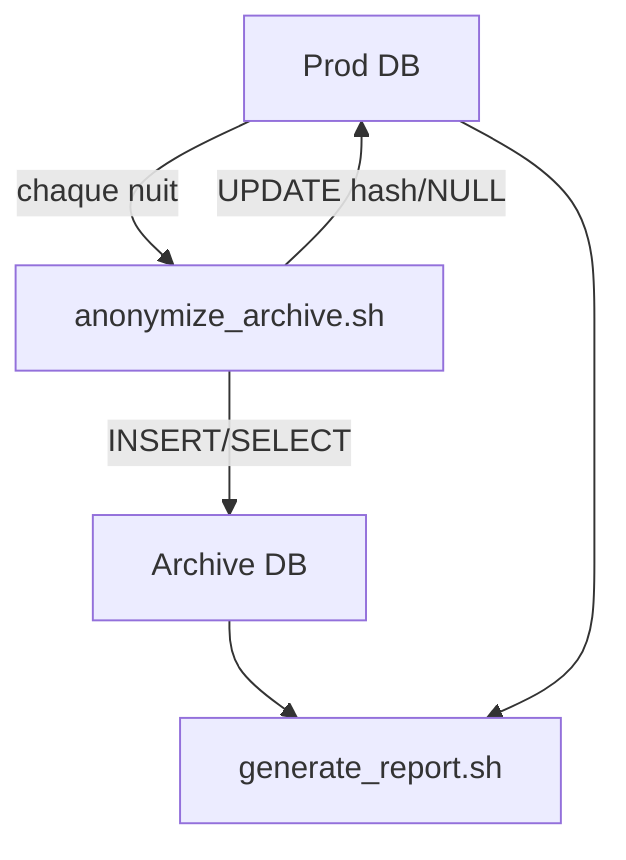

# 02 – Processus automatisé : archivage & anonymisation

Cet opus décrit **comment** la chaîne de conformité est mise en œuvre : scripts, cron, sécurité.

---

## 1. Vue d’ensemble



1. **Archivage** : copie des clients inactifs (> 3 ans) & de leurs factures dans `archive.*`.
2. **Anonymisation** : hachage/troncature en base `prod` pour rendre les enregistrements non identifiants.
3. **Continuité de service** : aucune indisponibilité ; les opérations se font hors transaction lourde.

---

## 2. Scripts Bash & SQL

### 2.1. `scripts/anonymize_archive.sh`

```bash
#!/usr/bin/env bash
set -euo pipefail

ARCHIVE_DB="archive"
PROD_DB="prod"
CUTOFF="DATE_SUB(CURDATE(), INTERVAL 3 YEAR)"

mysql --user=root <<SQL
CREATE DATABASE IF NOT EXISTS \`$ARCHIVE_DB\`;
CREATE TABLE IF NOT EXISTS \`$ARCHIVE_DB\`.clients  LIKE \`$PROD_DB\`.clients;
CREATE TABLE IF NOT EXISTS \`$ARCHIVE_DB\`.factures LIKE \`$PROD_DB\`.factures;

INSERT IGNORE INTO \`$ARCHIVE_DB\`.clients
  SELECT * FROM \`$PROD_DB\`.clients WHERE last_activity < $CUTOFF;

INSERT IGNORE INTO \`$ARCHIVE_DB\`.factures f
  SELECT f.* FROM \`$PROD_DB\`.factures f
   JOIN \`$PROD_DB\`.clients c ON c.id = f.id_client
   WHERE c.last_activity < $CUTOFF;

UPDATE \`$PROD_DB\`.clients SET
  nom     = SHA2(nom,256),
  prenom  = SUBSTRING(SHA2(prenom,256),1,20),
  email   = CONCAT('anon+',id,'@example.local'),
  adresse = NULL
WHERE last_activity < $CUTOFF;
SQL
```

*Notes* :

* `INSERT IGNORE` évite les doublons si le script tourne plusieurs fois.
* La politique d’anonymisation est minimaliste mais conforme (hash non réversible + e‑mail neutralisé).

### 2.2. `scripts/setup.sh`

Installe le schéma, injecte des données de test et crée le fichier cron :

```bash
sudo ./scripts/setup.sh
```

---

## 3. Planification Cron

Fichier `/etc/cron.d/rgpd` créé par `setup.sh` :

```
# Archivage + anonymisation nocturne
30 2 * * * root /opt/rgpd/anonymize_archive.sh >> /var/log/rgpd.log 2>&1
# Rapport annuel (22/12 04:00)
0 4 22 12 * root /opt/rgpd/generate_report.sh > /srv/reports/rapport-$(date +\%Y).txt
```

> 👀 **Monitoring** : consultez `/var/log/rgpd.log` pour le suivi. Rotation gérée par logrotate.

---

## 4. Sécurité & bonnes pratiques

* **MySQL** uniquement accessible via socket local (port TCP fermé).
* Scripts *fail‑fast* grâce à `set -euo pipefail`.
* **Archive DB** : peut résider sur un volume chiffré LUKS pour renforcer la confidentialité.

---

**Prochaine étape :** [03 – Génération des rapports](./03-rapports.md)

